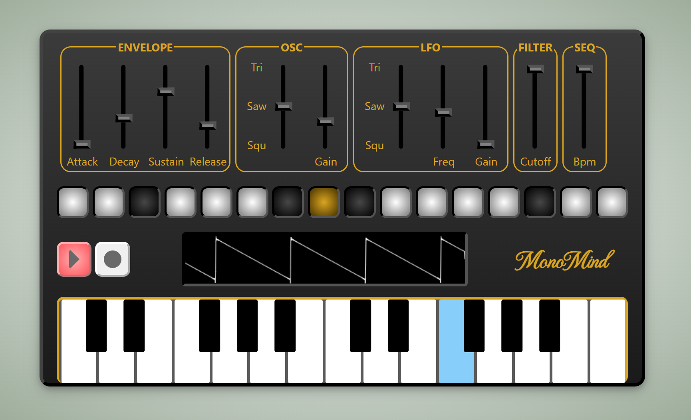

# MonoMind

MonoMind is a synthesizer written with ReactJS and Typescript using the Web Audio API. Like it's name suggest it is a monophonic synthesizer with a 16 step sequencer that let you progam any kind of melody.

### Technical features:

- 16 Step sequencer
- ADSR Envelope
- Main Oscillator with Triangle, Sawtooth and Squarewave
- LFO to control pitch
- Cutoff Filter
- Audio Visualizer
- 25 Key Keyboard

<!-- Live demo: https://denczo.github.io/jblaster/ -->

