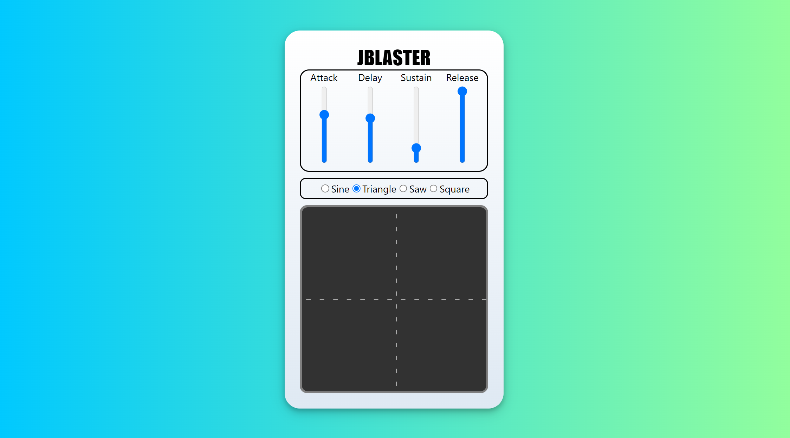

# JBLASTER

JBLASTER is a synthesizer written with ReactJS and Javascript using the Web Audio API.

In it's current version it comes with a touchpad that manipulates the frequency of a chosen waveform as well as the cuttoff frequency of a lowpass filter. It also has an ADSR envelope generator. 

Live demo: https://denczo.github.io/jblaster/

