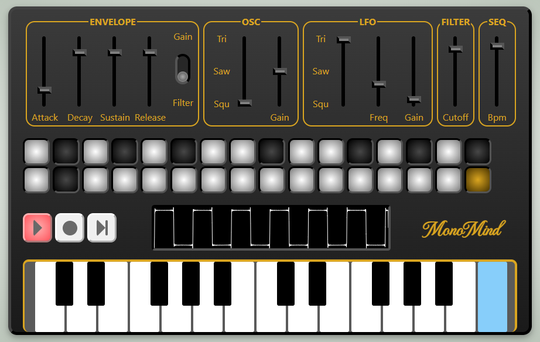

# MonoMind

MonoMind is a synthesizer written with ReactJS and Typescript using the Web Audio API. Like it's name suggest it is a monophonic synthesizer with a 32 step sequencer that let you progam any kind of melody. It supports responsive design.




### Technical features:

- 32 Step sequencer
- ADSR Envelope
- Main Oscillator with Triangle, Sawtooth and Squarewave
- LFO to control pitch
- Cutoff Filter
- Audio Visualizer
- 25 Key Keyboard

Live demo: https://www.monomind.info


### How to run:

```console
cd synth
npm start
```
Runs the app in the development mode.\
Open [http://localhost:3000](http://localhost:3000) to view it in your browser.